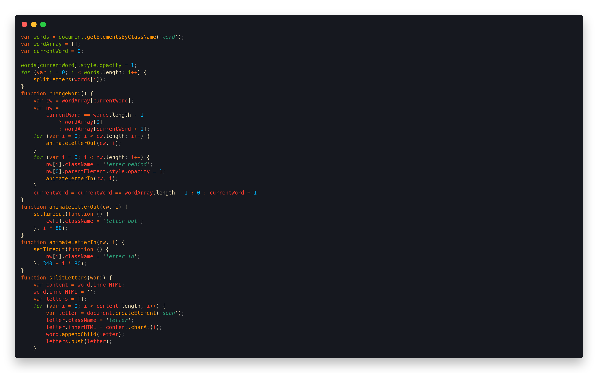
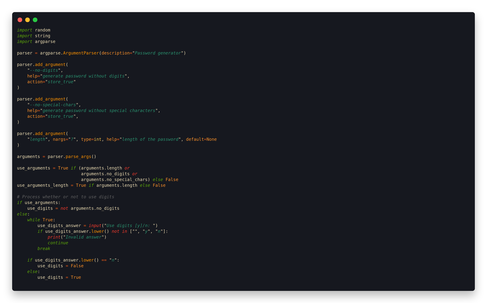
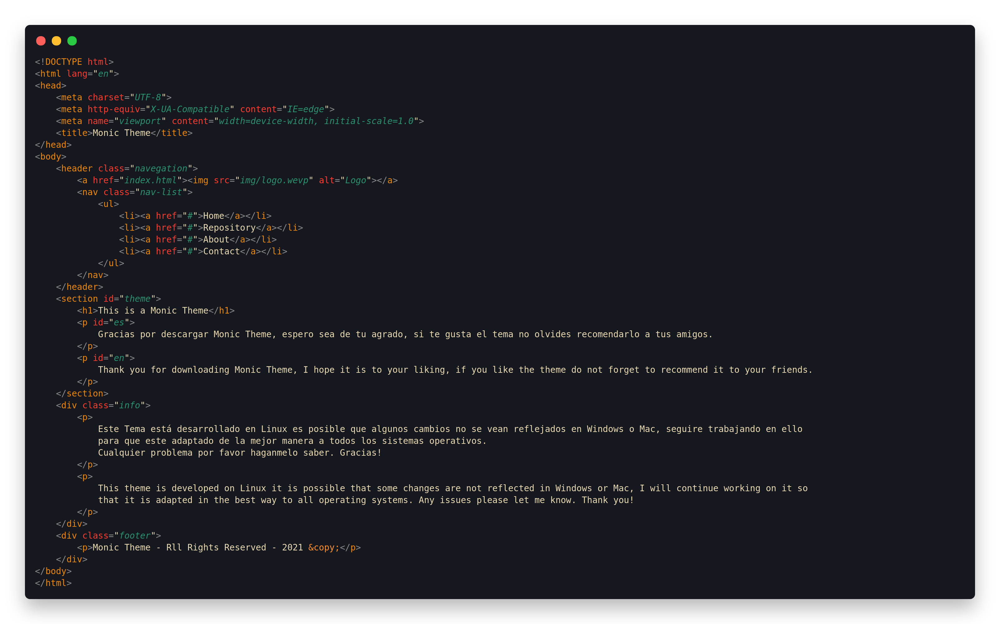
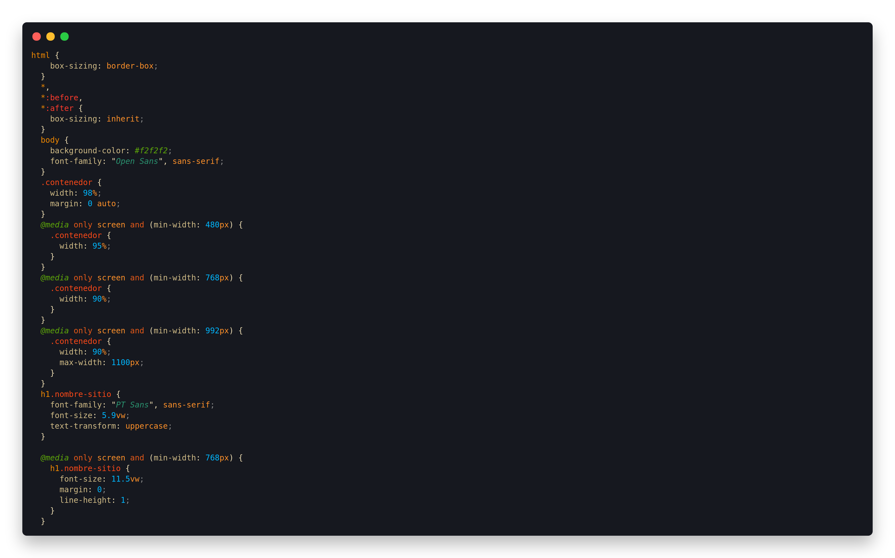

<h1 align="center">Monic Theme</h1>

No se como editar un README.md espero quede bien xd.
I don't know how to edit a README.md I hope it's okay xd.

<h3>JavaScript Code</h3>

<h3>Python Code</h3>

<h3>Html Code</h3>

<h3>CSS Code</h3>

Este Tema está desarrollado en Linux es posible que algunos cambios no se vean reflejados en Windows o Mac, seguire trabajando en ello
para que este adaptado de la mejor manera a todos los sistemas operativos.
Cualquier problema por favor haganmelo saber. Gracias!

This theme is developed on Linux it is possible that some changes are not reflected in Windows or Mac, I will continue working on it so
that it is adapted in the best way to all operating systems. Any issues please let me know. Thank you!

